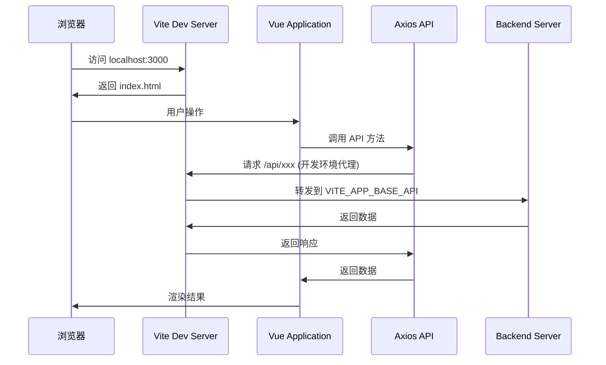
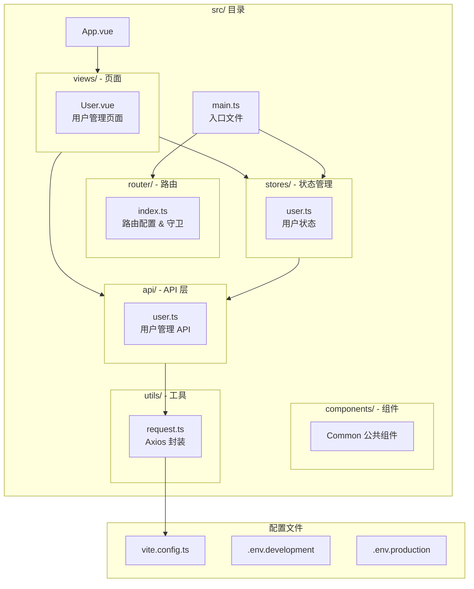

# JOSP-accountManagerVue3

[](https://vuejs.org/)
[
[](https://element-plus.org/)
[
[
[
[](LICENSE)

账户管理系统前端 - 基于 Vue 3 + Element Plus 构建的现代化管理系统

## 技术栈

| 技术 | 版本 | 说明 |
|------|------|------|
| Vue | 3.5.32 | 渐进式 JavaScript 框架 |
| Vite | 8.0.9 | 下一代前端构建工具 |
| Element Plus | 2.13.6 | Vue 3 UI 组件库 |
| Vue Router | 5.0.4 | 官方路由管理 |
| Pinia | 3.0.4 | 新一代状态管理 |
| Axios | 1.14.0 | HTTP 请求库 |
| TypeScript | 6.0.2 | JavaScript 超集 |

## 项目架构

### 请求流程图



### 项目结构图



## 功能介绍

### 核心功能

| 功能 | 描述 |
|------|------|
| 用户管理 | 用户分页查询、条件搜索、精准筛选 |
| 用户 CRUD | 新增、编辑、删除、批量删除用户 |
| 响应式表格 | Element Plus Table 组件，支持分页 |
| 表单验证 | 基于 Element Plus Form 的规则校验 |
| 状态管理 | Pinia 集中管理用户数据状态 |
| Token 认证 | 自动注入 Authorization Token |
| 错误处理 | 统一拦截 HTTP 错误，友好提示 |
| 路由守卫 | 登录验证，权限控制 |

### API 请求封装特性

- 自动携带 `Authorization` 请求头
- 统一错误码处理与提示
- 请求/响应拦截器
- 开发环境代理配置
- 环境变量动态配置

## 快速开始

### 环境要求

- Node.js >= 18.x
- npm >= 9.x

### 安装依赖

```bash
npm install
```

### 开发启动

```bash
npm run dev
```

访问 http://localhost:3000

### 生产构建

```bash
npm run build
```

### 预览构建

```bash
npm run preview
```

## 配置说明

### 环境变量

项目根目录创建 `.env.development` 文件：

```env
VITE_APP_BASE_API=http://localhost:8088
```

### API 代理配置

Vite 开发服务器自动代理 `/api` 请求到目标服务器，避免跨域问题。

代理配置位于 `vite.config.ts`：

```typescript
server: {
  proxy: {
    '/api': {
      target: 'http://localhost:8088',
      changeOrigin: true
    }
  }
}
```

### 目录结构

```
src/
├── api/              # API 接口定义
│   └── user.ts       # 用户相关 API
├── components/       # 公共组件
├── router/           # 路由配置
│   └── index.ts      # 路由守卫
├── stores/           # Pinia 状态管理
│   └── user.ts       # 用户状态
├── utils/            # 工具函数
│   └── request.ts    # Axios 实例封装
├── views/            # 页面组件
│   └── User.vue      # 用户管理页
├── App.vue           # 根组件
├── main.ts           # 入口文件
└── env.d.ts          # 环境类型声明
```

## License

[AGPL-3.0](LICENSE)
