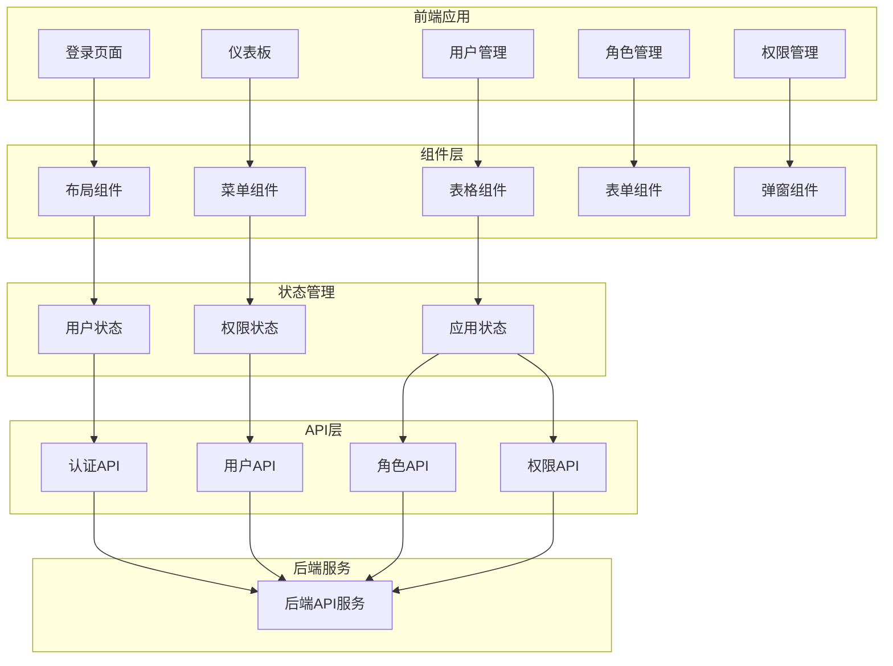

# 🎨 JOSP-AccountManagerVue3 - 账号管理系统前端


## 📖 项目简介

JOSP-AccountManagerVue3是账号管理系统的Vue3前端应用,提供用户管理、角色管理、权限管理等功能,配合JOSP-accountManageJava后端使用。

## 🏗️ 系统架构



## 🚀 快速开始

```bash
# 克隆项目
git clone https://github.com/yourusername/JOSP-accountManagerVue3.git

# 安装依赖
npm install

# 配置API地址
# 修改 .env.development
VITE_API_BASE_URL=http://localhost:8080/api

# 启动开发服务器
npm run dev

# 构建生产版本
npm run build
```

## 🛠️ 技术栈

| 技术 | 版本 | 说明 |
|------|------|------|
| Vue.js | 3.x | 前端框架 |
| Element Plus | 2.x | UI组件库 |
| Vite | 5.x | 构建工具 |
| Vue Router | 4.x | 路由管理 |
| Pinia | 2.x | 状态管理 |
| Axios | - | HTTP客户端 |
| TypeScript | 5.x | 类型系统 |

## 📁 项目结构

```
JOSP-accountManagerVue3/
├── src/
│   ├── api/                # API接口
│   │   ├── auth.ts        # 认证API
│   │   ├── user.ts        # 用户API
│   │   ├── role.ts        # 角色API
│   │   └── permission.ts  # 权限API
│   ├── components/         # 公共组件
│   ├── layouts/            # 布局组件
│   ├── router/             # 路由配置
│   ├── store/              # 状态管理
│   │   ├── modules/
│   │   │   ├── user.ts
│   │   │   ├── permission.ts
│   │   │   └── app.ts
│   ├── styles/             # 样式文件
│   ├── utils/              # 工具函数
│   ├── views/              # 页面视图
│   ├── App.vue
│   └── main.ts
├── public/                 # 静态资源
├── .env.development        # 开发环境配置
├── .env.production         # 生产环境配置
├── vite.config.ts          # Vite配置
└── package.json
```

## 💡 核心功能

### 用户管理

```vue
<template>
  <div class="user-manage">
    <el-card>
      <template #header>
        <div class="card-header">
          <span>用户管理</span>
          <el-button type="primary" @click="handleAdd">新增用户</el-button>
        </div>
      </template>
      
      <el-table :data="userList" border>
        <el-table-column prop="username" label="用户名" />
        <el-table-column prop="email" label="邮箱" />
        <el-table-column prop="phone" label="手机号" />
        <el-table-column prop="status" label="状态">
          <template #default="{ row }">
            <el-tag :type="row.status === 1 ? 'success' : 'danger'">
              {{ row.status === 1 ? '启用' : '禁用' }}
            </el-tag>
          </template>
        </el-table-column>
        <el-table-column label="操作" width="200">
          <template #default="{ row }">
            <el-button link @click="handleEdit(row)">编辑</el-button>
            <el-button link type="danger" @click="handleDelete(row)">删除</el-button>
          </template>
        </el-table-column>
      </el-table>
      
      <el-pagination
        v-model:current-page="queryParams.page"
        v-model:page-size="queryParams.size"
        :total="total"
        @current-change="fetchUserList"
      />
    </el-card>
  </div>
</template>

<script setup lang="ts">
import { ref, onMounted } from 'vue'
import { getUserList, deleteUser } from '@/api/user'

const userList = ref([])
const total = ref(0)
const queryParams = ref({
  page: 1,
  size: 10,
  username: ''
})

const fetchUserList = async () => {
  const res = await getUserList(queryParams.value)
  userList.value = res.data.list
  total.value = res.data.total
}

const handleAdd = () => {
  // 打开新增用户对话框
}

const handleEdit = (row) => {
  // 打开编辑用户对话框
}

const handleDelete = async (row) => {
  await deleteUser(row.id)
  fetchUserList()
}

onMounted(() => {
  fetchUserList()
})
</script>
```

### 角色权限管理

```vue
<template>
  <div class="role-manage">
    <el-tree
      ref="treeRef"
      :data="permissionTree"
      show-checkbox
      node-key="id"
      :default-checked-keys="checkedKeys"
    />
    
    <el-button type="primary" @click="handleSave">保存权限</el-button>
  </div>
</template>

<script setup lang="ts">
import { ref, onMounted } from 'vue'
import { getPermissionTree, getRolePermissions, updateRolePermissions } from '@/api/permission'

const props = defineProps({
  roleId: {
    type: Number,
    required: true
  }
})

const permissionTree = ref([])
const checkedKeys = ref([])

const fetchPermissions = async () => {
  const res = await getPermissionTree()
  permissionTree.value = res.data
}

const fetchRolePermissions = async () => {
  const res = await getRolePermissions(props.roleId)
  checkedKeys.value = res.data
}

const handleSave = async () => {
  const checkedNodes = treeRef.value.getCheckedKeys()
  await updateRolePermissions({
    roleId: props.roleId,
    permissionIds: checkedNodes
  })
}

onMounted(() => {
  fetchPermissions()
  fetchRolePermissions()
})
</script>
```

## 🎯 核心特性

- **用户管理**: 用户的增删改查、状态管理
- **角色管理**: 角色创建、权限分配
- **权限管理**: 菜单权限、按钮权限控制
- **路由守卫**: 基于权限的动态路由
- **主题定制**: 支持多主题切换
- **国际化**: 支持多语言

## 📝 更新日志

### v1.0.0 (2024-01-01)
- ✨ 初始版本发布
- ✨ 完成用户管理功能
- ✨ 完成角色管理功能
- ✨ 完成权限管理功能
- ✨ 完成登录认证功能

---

⭐ 如果这个项目对你有帮助,欢迎Star支持!
