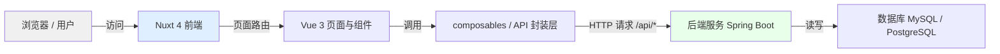

# JOSP-accountManagerVue3

## 项目简介

JOSP-accountManagerVue3 是“账户管理系统”的前端项目，基于 Nuxt 4 + Vue 3 + @nuxt/ui 构建，专注于系统用户账户的可视化管理。

核心功能包括：

- 用户列表分页查询
- 按用户名、状态搜索与重置
- 新增 / 编辑 / 删除用户
- 批量删除用户
- 使用 `localStorage` token 进行请求鉴权（如需）

项目通过 `/api` 前缀与后端 RESTful 服务通信（默认后端地址为 `http://localhost:8088/api`），实现前后端分离的账户管理体验。

## 系统架构图


```mermaid
flowchart LR
    A[浏览器 / 用户] -->|访问| B[Nuxt 4 前端]
    B -->|页面路由| C[Vue 3 页面与组件]
    C -->|调用| D[composables / API 封装层]
    D -->|HTTP 请求 /api/*| E[后端服务 Spring Boot]
    E -->|读写| F[数据库 MySQL / PostgreSQL]

    style A fill:#f0f0f0
    style B fill:#e0efff
    style E fill:#e8ffea
```

说明：

- 前端运行在 Nuxt / Nitro 之上，开发服务器默认监听 `http://localhost:3000`。
- `composables/useUserApi.ts` 与 `app/api/user.js` 提供用户相关的 API 调用封装。
- 后端服务需独立启动，前端仅负责界面与交互。

## 技术栈

| 层级 | 技术 |
|---|---|
| 前端框架 | [Nuxt 4](https://nuxt.com/) |
| UI 框架 | [Vue 3](https://vuejs.org/) + [Vue Router 4](https://router.vuejs.org/) |
| 组件库 | [@nuxt/ui v4](https://ui.nuxt.com/) |
| 语言 | TypeScript 5 |
| 样式 | Tailwind CSS（由 @nuxt/ui 内置）+ 自定义 CSS Variables |
| HTTP 请求 | 原生 `fetch`（composables）+ axios（app/utils/request.js） |
| 包管理 | pnpm |
| 构建工具 | Vite（Nuxt 内置） |

## 项目结构

```text
JOSP-accountManagerVue3/
├── app/
│   ├── api/user.js           # 基于 axios 的用户 API 封装
│   └── utils/request.js      # axios 请求实例与拦截器
├── assets/
│   └── css/main.css          # 全局样式与 CSS 变量
├── composables/
│   └── useUserApi.ts         # 基于 fetch 的用户 API 组合式函数
├── layouts/
│   └── default.vue           # 默认布局（页头 / 主体 / 页脚）
├── pages/
│   ├── index.vue             # 首页（路由占位）
│   └── user.vue              # 用户管理列表页
├── app.vue                   # 应用根组件
├── nuxt.config.ts            # Nuxt 配置文件
├── package.json              # 项目依赖与脚本
├── pnpm-lock.yaml            # pnpm 锁定文件
├── design.md                 # 项目设计说明
└── LICENSE                   # AGPL-3.0 许可证
```

## 启动方式

### 环境要求

- Node.js 18+
- pnpm 8+

### 安装依赖

```bash
pnpm install
```

### 启动开发服务器

```bash
pnpm dev
```

默认访问地址：`http://localhost:3000`

### 其他常用命令

```bash
pnpm build      # 构建生产包
pnpm generate   # 生成静态站点
pnpm preview    # 预览生产构建
```

### 后端地址配置

如需修改后端 API 地址，可在启动时设置环境变量：

```bash
NUXT_PUBLIC_BASE_URL=http://localhost:8088/api pnpm dev
```

或在项目根目录创建 `.env` 文件：

```env
NUXT_PUBLIC_BASE_URL=http://localhost:8088/api
```

> 注意：本项目仅包含前端代码，后端服务需要另外启动并暴露 `/api/user/*` 相关接口。

## 开源协议

本项目采用 [GNU Affero General Public License v3.0](https://www.gnu.org/licenses/agpl-3.0.html)（AGPL-3.0）开源协议。

详见项目根目录下的 [LICENSE](./LICENSE) 文件。
